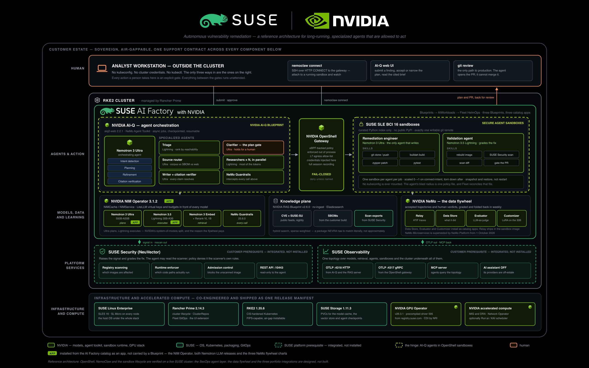
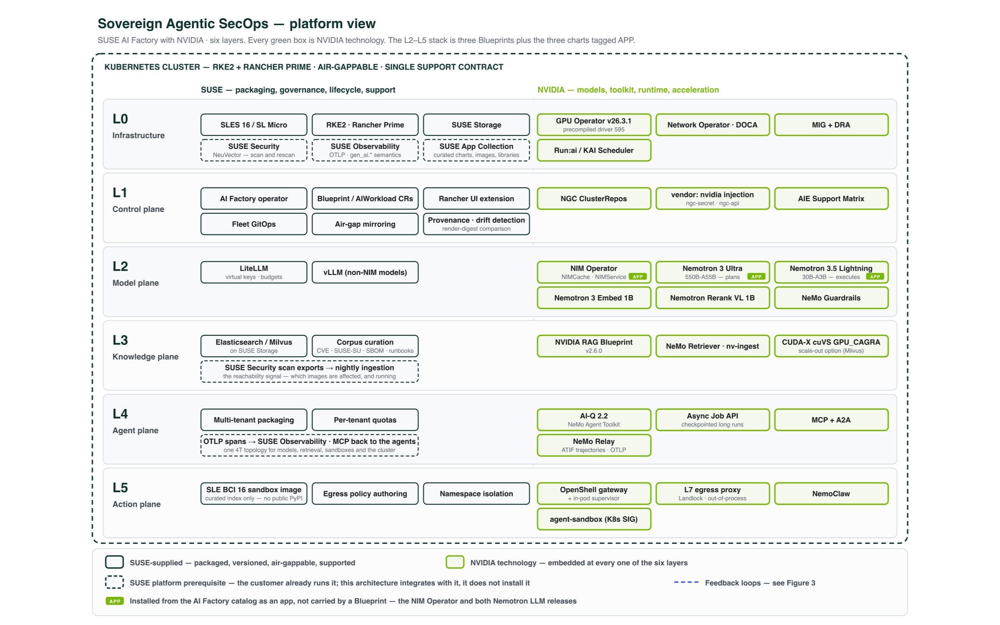
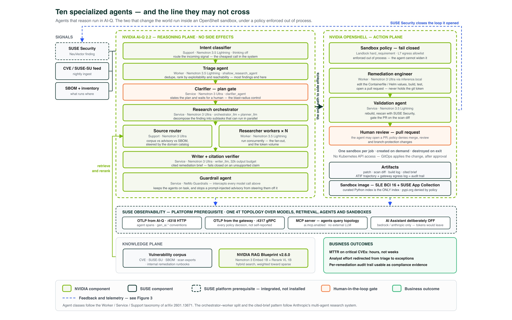
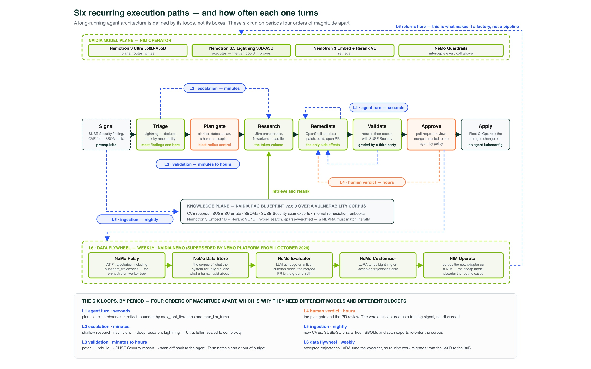
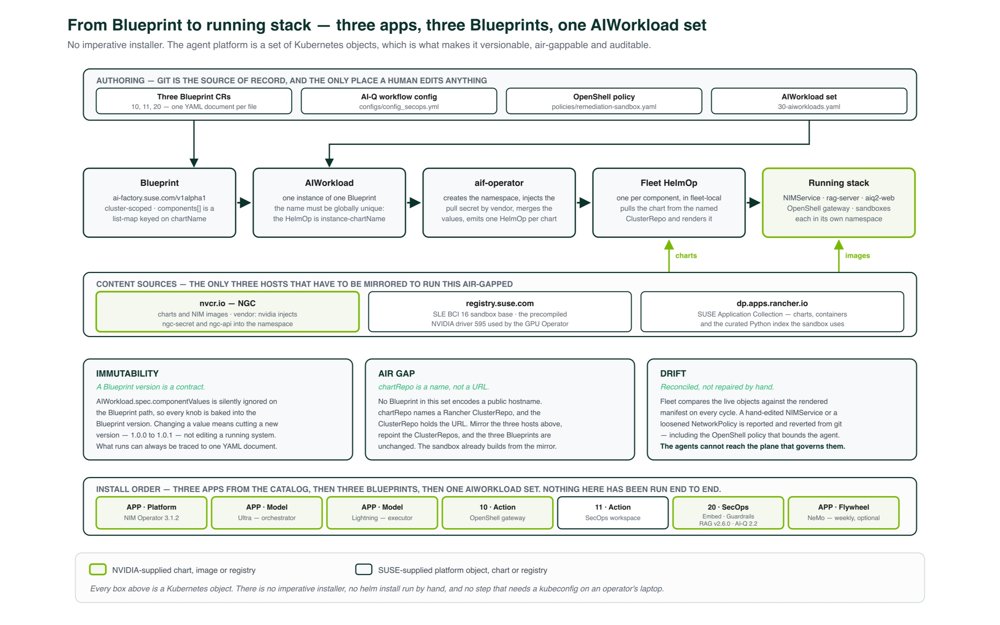
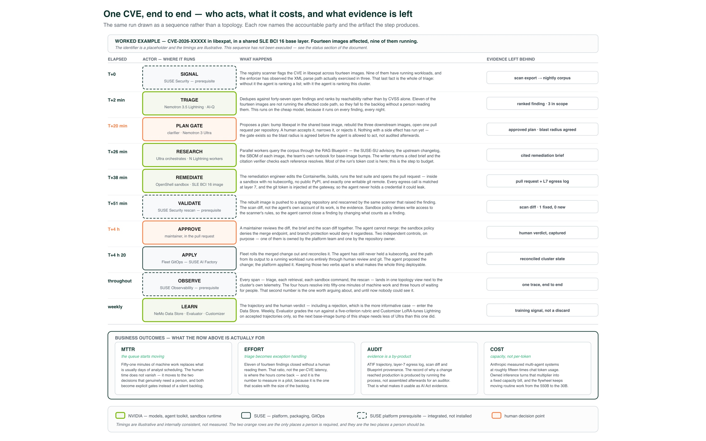

# Sovereign Agentic SecOps

### Autonomous vulnerability remediation on SUSE AI Factory with NVIDIA

A reference architecture for long-running, specialized agents that are allowed to act —
and a description of exactly what stops them acting badly.



*Figure 0. Where everything runs. The analyst is outside the cluster and has no
kubeconfig. Inside RKE2, the agent plane, the OpenShell gateway and the sandboxes are
separated on purpose. SUSE Security and SUSE Observability are integrated, not installed
— they are the customer's own platform services. Boxes tagged `APP` are installed from the
AI Factory catalog rather than carried by a Blueprint; sections 4 and 7 explain why the
split falls where it does.*

> **Status.** This is a reference architecture, not a shipped product and not a customer
> deployment. OpenShell, NemoClaw and the sandbox lifecycle are verified running on a live
> SUSE cluster. The SecOps agent layer, the data flywheel, the sandbox image and the three
> SUSE portfolio integrations are designed and specified, but have never been run.
> Section 11 is a line-by-line ledger of which is which. Read it before quoting anything
> here.

---

## 1. The problem is a queue, not a question

A platform team running a few hundred container images receives a continuous stream of
vulnerability findings. A registry scan of a mid-sized estate returns thousands of rows.
Most are irrelevant — the vulnerable code path is not reachable, the package is not
installed at runtime, the image has not been deployed in a year. A handful are urgent.
Nobody knows which handful until someone reads them.

So the finding rate exceeds the remediation rate, permanently, and the backlog is not a
knowledge problem. The team already knows what a CVE is. They know how to bump a package
and rebuild an image. What they do not have is the labour to do it several hundred times a
month, each time chasing down which images share the affected base layer, which of those
are actually running, what the fixed version is called in SUSE's errata, and whether the
rebuild broke anything.

A retrieval chatbot does not move this number. It answers questions about the queue. The
queue is not short of answers; it is short of *changes*. Moving the number requires a
system that can read the finding, decide whether it matters, work out the fix, **make the
change**, prove the change worked, and hand a human a reviewable pull request instead of a
row in a spreadsheet.

That is an agentic workload, and it is the honest version of the agentic pitch: the value
is not in the model's eloquence, it is in the fact that something at the end of the
pipeline is permitted to write to a git repository. Which is also precisely why most
organisations will not run one. Granting an LLM write access to source control, in an
estate it can also scan, on a cluster it can also reach, is a straightforward way to turn
a vulnerability backlog into an incident.

This architecture is an answer to that second problem as much as the first. The interesting
engineering is not the agents. It is the substrate that makes an agent safe to let loose.

---

## 2. The platform view



*Figure 1. Six layers. NVIDIA supplies the models, the agent toolkit and the sandbox
runtime. SUSE supplies the operating system, the Kubernetes, the packaging, the lifecycle
and the governance — and one support contract over all of it. The three boxes tagged `APP`
in L2 are the model plane, which is installed from the catalog and not from a Blueprint;
everything else in L2–L5 arrives as a component of one of the three Blueprints.*

The division of labour is the point of the whole exercise, so it is worth stating flatly
before the detail:

> NVIDIA builds the intelligence and the execution runtime. SUSE turns them into something
> installable, versioned, air-gappable, multi-tenant and supportable.

Neither half is interesting alone. NVIDIA's Nemotron models and AI-Q toolkit are excellent
and entirely unopinionated about how they reach a regulated customer's datacentre.
Kubernetes distributions are plentiful and know nothing about serving a 550B-parameter
mixture-of-experts model. The product is the seam.

| Layer | SUSE supplies | NVIDIA supplies |
|---|---|---|
| **L0 Infrastructure** | SLES 16 / SL Micro, RKE2 1.35.6, Rancher Prime 2.14.3, SUSE Storage 1.11.3, SUSE Security, SUSE Observability | GPU Operator v26.3.1 with the precompiled driver 595, Network Operator / DOCA, MIG and DRA, optionally Run:ai / KAI Scheduler |
| **L1 Control plane** | AI Factory operator, `Blueprint` / `AIWorkload` CRDs, the Rancher UI extension, Fleet GitOps, air-gap registry mirroring | NGC ClusterRepos, credential injection for `vendor: nvidia`, the AI Enterprise support matrix |
| **L2 Model plane** | LiteLLM for virtual keys and budgets, vLLM for non-NIM models | NIM Operator 3.1.2 → `NIMCache` / `NIMService`: Nemotron 3 Ultra, Nemotron 3.5 Lightning, Nemotron 3 Embed 1B, Llama Nemotron Rerank VL 1B, NeMo Guardrails |
| **L3 Knowledge plane** | SUSE Storage PVCs, Application Collection charts | NVIDIA RAG Blueprint v2.6.0, NeMo Retriever / nv-ingest, cuVS `GPU_CAGRA` where the VRAM allows |
| **L4 Agent plane** | multi-tenant packaging, per-tenant quotas, Blueprint versioning | AI-Q 2.2 (`aiq2-web` 2.2.1), NeMo Agent Toolkit: specialized agents, async job API, checkpointed long-running jobs, MCP and A2A |
| **L5 Action plane** | SLE BCI 16 sandbox images, the egress policy, tenant isolation, Blueprint packaging | OpenShell gateway and supervisor, NemoClaw, NeMo Relay tracing, the agent-sandbox controller |

Two things in that table are genuine co-engineering rather than co-marketing, and both are
worth naming because they are the kind of detail that decides whether an air-gapped install
succeeds.

The **GPU Operator** entry is pinned to v26.3.1 in SUSE's own release manifest, with the
precompiled NVIDIA driver 595 served from `registry.suse.com/third-party/nvidia` and CDI
enabled through the NRI plugin. A precompiled driver matched to a specific SLES kernel is
the difference between a GPU node that joins the cluster and a GPU node that spends twenty
minutes building a kernel module and then fails on a kernel update at 3 a.m.

The **`vendor:` field** on a Blueprint component is smaller and more revealing.
`vendor: nvidia` makes the operator inject the `ngc-secret` and `ngc-api` credentials;
`vendor: suse` uses the combined SUSE pull secret. Nobody writes an image-pull secret
reference by hand. That is what "productised" means in practice: the fifty small things
that are individually trivial and collectively the reason an install takes a week instead
of an afternoon.

### Where the three SUSE platform products sit

SUSE Security, SUSE Observability and the SUSE Application Collection appear throughout
this architecture and **none of them is installed by it**. They are platform prerequisites
the customer already runs. What this architecture contributes is the integration — the
endpoints, the secrets, the egress rules and the exact API surface each one is allowed to
expose to an agent.

That separation is deliberate and it is a product decision, not a shortcut. A platform team
that already operates SUSE Security does not want an agent blueprint installing a second
copy of it; an architecture that only works if it owns the entire cluster is not one anyone
adopts incrementally.

---

## 3. Ten specialized agents, split by who may change the world



*Figure 2. The agent topology. Everything above the gateway researches. Only the two agents
below it can alter state, and they do so inside a sandbox whose policy they cannot read or
modify.*

The academic vocabulary here comes from *Orchestration of Multi-Agent Systems*
([arXiv:2601.13671](https://arxiv.org/html/2601.13671v1)), which classifies agents as
**Worker** (does the task), **Service** (provides a capability to other agents) and
**Support** (routes, classifies, observes). It is a useful taxonomy because it cuts across
the more obvious "which model" axis and exposes something else: most of the agents in a
research system are Support and Service agents, and they are cheap.

| Agent | Class | Runs in | Model | Job |
|---|---|---|---|---|
| Intent classifier | Support | AI-Q | Nemotron 3.5 Lightning | route the incoming signal, cheaply |
| Triage agent | Worker | AI-Q | Nemotron 3.5 Lightning | dedupe and rank by EPSS, KEV and reachability |
| Clarifier — the plan gate | Service | AI-Q | Nemotron 3 Ultra | propose a plan and **hold for a human** |
| Research orchestrator | Service | AI-Q | Nemotron 3 Ultra | decompose into parallel subtasks |
| Source router | Support | AI-Q | Nemotron 3 Ultra | corpus vs SBOM vs advisory vs web |
| Researcher workers × N | Worker | AI-Q | Nemotron 3.5 Lightning | parallel retrieval; most of the token spend |
| Writer + citation verifier | Service | AI-Q | Nemotron 3 Ultra | produce a brief where every claim resolves |
| **Remediation engineer** | **Worker** | **OpenShell sandbox** | Nemotron 3 Ultra | edit the manifest or Containerfile, build, test, open a PR |
| **Validation agent** | **Service** | **OpenShell sandbox** | Nemotron 3.5 Lightning | rebuild, rescan with SUSE Security, gate the PR |
| Guardrail agent | Service | NeMo Guardrails | NemoGuard rails | topical and safety rails on every model call above |

The two bold rows are the architecture. Eight agents read things; two agents change things.
The eight run in the AI-Q pod with ordinary Kubernetes network policy around them. The two
run inside an OpenShell sandbox, behind a policy engine, with no credentials in their
possession and no route to the Kubernetes API at all.

That split is not a stylistic preference. It is what allows the research half to be
permissive — retrieval over a large corpus, wide web access at the edges, many concurrent
workers — without that permissiveness ever touching the half that can write.

### The specialization is data, not code

A fair objection to any agent architecture is that "specialized agent" usually means "the
same generic agent with a different prompt". Here the specialization is declared in
configuration that upstream AI-Q already supports:

```yaml
deep_research_agent:
  _type: deep_research_agent
  enable_citation_verification: true
  orchestrator_llm: nemotron_ultra_llm
  source_router_llm: nemotron_ultra_llm
  researcher_llm:   nemotron_lightning_agent_llm
  planner_llm:      nemotron_ultra_llm
  writer_llm:       nemotron_ultra_writer_llm
  domain_catalog_path: configs/secops_domain_catalog.yml
  skills:  deep_research_skills
  sandbox: deep_research_sandbox
```

Every `_type` in `configs/config_secops.yml` exists in AI-Q 2.2 upstream — they were read
from `NVIDIA-AI-Blueprints/aiq` at tag v2.2.0. There are no invented agent types, because
`_type` is not free text: declaring `_type: triage_agent` produces a startup error, not a
triage agent. The SecOps specialization lives in the **domain catalog**, which is
upstream's supported mechanism for exactly this, and in the sandbox policy.

`enable_citation_verification: true` is the single most important line in that file. A
remediation brief that cites an advisory which does not say what the brief claims is worse
than no brief at all: it launders a hallucination into a change request with a footnote.
AI-Q fails closed when verification fails.

### Ultra plans, Lightning executes

NVIDIA calls this a *system of models*, and the naming on the Nemotron 3.5 Lightning
release — *"fast, accurate specialized task execution for long-running agents"* — is not
subtle about the intended role. It maps one-to-one onto the orchestrator-worker pattern
Anthropic documented in its multi-agent research system: one expensive model that decomposes
and synthesises, many cheap models that fan out.

The economics follow directly. The researcher workers issue the overwhelming majority of
the calls, and they run on a 30B-A3B model with roughly 3B active parameters. The 550B model
is invoked for planning, routing, writing and the final synthesis — the steps where a wrong
decision is expensive and there are few of them. Section 6 puts numbers on why this matters.

---

## 4. Where NVIDIA technology is embedded

Everything below is a real chart in a real ClusterRepo, resolved against the live index on
the authoring cluster. The point of listing versions is that the claim should be auditable
rather than atmospheric.

The **Installed by** column is the packaging split drawn in Figures 0 and 1: charts marked
*app* are installed from the AI Factory catalog before anything else and carry the `APP` tag
in both figures; the rest arrive as components of one of the three Blueprints.

| Component | ClusterRepo | Chart | Version | Installed by | Role |
|---|---|---|---|---|---|
| NIM Operator | `nvidia` | `k8s-nim-operator` | 3.1.2 | app | `NIMCache` / `NIMService` lifecycle |
| Nemotron 3 Ultra 550B-A55B | `nvidia` | `nim-llm` | 2.0.4-pb6.6 | app, release `nemotron-ultra` | orchestration, planning, writing |
| Nemotron 3.5 Lightning 30B-A3B | `nvidia` | `nim-llm` | 2.0.4-pb6.6 | app, release `nemotron-lightning` | execution, triage, research workers |
| Nemotron 3 Embed 1B | `nim-nvidia` | `nvidia-nim-nemotron-3-embed-1b` | 2.2.2 | blueprint 20 | dense retrieval |
| Llama Nemotron Rerank VL 1B v2 | bundled | `nvidia-blueprint-rag` subchart | ships with v2.6.0 | blueprint 20, subchart toggle | reranking |
| NeMo Guardrails | `nvidia-nemo-microservices` | `nemo-guardrails` | 25.6.0 | blueprint 20 | topical and safety rails |
| NVIDIA RAG Blueprint | `nvidia-blueprints` | `nvidia-blueprint-rag` | v2.6.0 | blueprint 20 | the knowledge plane |
| AI-Q | `nvidia-blueprints` | `aiq2-web` | 2.2.1 | blueprint 20 | the agent plane |
| OpenShell gateway | `openshell` | `helm-chart` | `0.0.0-dev.17171cd9337a2181d4bb5a9e711e1f2ad5f69388` | blueprint 10, release `openshell` | the action plane |
| OpenShell workspace | `openshell` | `openshell-workspace` | same dev tag | blueprint 11, one per sandbox namespace | per-namespace sandbox authority |
| NeMo Data Store / Evaluator / Customizer | `nvidia-nemo-microservices` | `nemo-*` | 25.6.0 | apps | the data flywheel |
| GPU Operator | `nvidia` | `gpu-operator` | v26.3.1 | platform, from the release manifest | driver 595, MIG, DRA, CDI |

Model identifiers, as used in `config_secops.yml`:

```
nvidia/nemotron-3-ultra-550b-a55b
nvidia/nemotron-3.5-lightning-30b-a3b
nvidia/nemotron-3-embed-1b
nvidia/llama-nemotron-rerank-vl-1b-v2
```

Three notes that will save someone a bad afternoon.

**AI-Q 2.2, not the 2.1 that ships today.** The AI Factory operator ships a
`nvidia-aiq-with-rag` Blueprint pinned to `aiq2-web` 2.1.0. This architecture requires
2.2.1, because AI-Q 2.2 is the release that supports OpenShell as a skill sandbox — which is
the hinge of the entire design. The cost of that choice is that the known-good 2.1 workflow
config in this repository could not be reused verbatim; `config_secops.yml` is written
against the 2.2 schema.

**The model plane is not a Blueprint at all.** The NIM Operator and both Nemotron tiers are
installed from the AI Factory app catalog, where `k8s-nim-operator` and `nim-llm` are
first-class Supported entries. This is the product's own convention — the shipped
`nvidia-aiq-with-rag` Blueprint serves a Nemotron model and contains no LLM — and it side-steps
a constraint that would otherwise bite: `Blueprint.spec.components` is a CEL list-map keyed on
`chartName`, so two components both named `nim-llm` in one Blueprint are rejected by the API
server. Ultra and Lightning are the same chart. They could never have shared a Blueprint.

**Chart coordinates are verified; NIM image tags are not.** The NGC repositories that hold
the Nemotron NIMs are gated, so the `values:` blocks for those charts are illustrative and
the image tags are placeholders. A wrong tag fails the NIM Operator's hardware-profile
lookup with an error that does not mention the tag, which is an unpleasant way to spend a
morning. Pin exact versions from the NGC catalog.

### GPU-accelerated retrieval, when there is room for it

The knowledge plane sets `APP_VECTORSTORE_ENABLEGPUSEARCH: "False"`, matching the shipped
`nvidia-rag-minimal` Blueprint, because on a constrained deployment every gigabyte of VRAM
belongs to the models. There is a real acceleration available here on a full deployment —
cuVS / CAGRA backs `GPU_CAGRA` indexing — but it is not a one-line values change, and the
Blueprint says so rather than implying otherwise: RAG v2.6.0 defaults its vector store to
**Elasticsearch**, where both `APP_VECTORSTORE_INDEXTYPE: "GPU_CAGRA"` and
`ENABLEGPUSEARCH` are inert. Taking the acceleration means switching
`APP_VECTORSTORE_NAME` to Milvus first, which is a different operational commitment.

Retrieval is also deliberately **sparse-weighted** — `DENSE_WEIGHT: "0.4"`,
`SPARSE_WEIGHT: "0.6"`. General RAG tuning advice favours dense retrieval. This corpus does
not behave like general prose: a package NEVRA has to match *literally*, and an embedding
model that helpfully considers `libexpat-2.6.2-150600.3.6.1` similar to
`libexpat-2.6.4-150600.3.9.1` has produced exactly the wrong answer.

---

## 5. Governed action: OpenShell as the execution substrate

The agents that matter can write to a source repository. Everything in this section exists
because of that sentence.

OpenShell is NVIDIA's sandbox runtime: a gateway plus a per-sandbox supervisor that
enforces a filesystem, process and network policy around an agent's execution. AI-Q 2.2
names it as one of two supported skill-sandbox backends. NVIDIA's own operator guide makes
the architectural claim that justifies packaging it as a Blueprint rather than importing it
as a library:

> OpenShell is an external runtime and authentication boundary, not merely a Python
> dependency: an operator must own the gateway service, registration, credentials, version,
> and availability.

An AI Factory Blueprint is exactly that operator.

Two properties make the enforcement meaningful, and both are structural rather than
behavioural — they do not depend on the model cooperating.

**1. The policy is enforced out of process.** The supervisor and the egress proxy are not
libraries the agent imports; they are separate processes the agent cannot reach. A
jailbroken agent, a prompt-injected advisory, a malicious dependency in a cloned repository
— none of them can widen the policy, because none of them run where the policy is
evaluated.

**2. Credentials are injected at the boundary.** The agent never holds the git token, the
model key or the SUSE Security API key. It emits a request with a placeholder; the proxy
admits or denies the request, and only then substitutes the real credential on the way out.
Exfiltrating the token is not a matter of being clever. The token is not in the sandbox.

### The policy is the specification

`policies/remediation-sandbox.yaml` is the security boundary, and it was written on the
assumption that if the prose and the policy disagree, the policy wins. A few of its
decisions are worth reproducing, because they are the ones that distinguish a real control
from a gesture.

The git forge is the only write access in the file, and it is enumerated rather than
granted by preset:

```yaml
rules:
  - allow: { method: GET,   path: "/repos/*/*" }
  - allow: { method: POST,  path: "/repos/*/*/git/refs" }
  - allow: { method: POST,  path: "/repos/*/*/git/commits" }
  - allow: { method: POST,  path: "/repos/*/*/pulls" }
deny_rules:
  - { method: PUT,  path: "/repos/*/*/pulls/*/merge" }
  - { method: POST, path: "/repos/*/*/pulls/*/reviews" }
  - { method: PUT,  path: "/repos/*/*/branches/*/protection" }
```

OpenShell offers `access: read-write` as a convenient preset. It expands to GET, HEAD,
OPTIONS, POST, PUT and PATCH across every path on the host — which is enough to open a pull
request, and also enough to merge it, approve it, disable branch protection and rotate a
webhook. The entire argument for autonomous remediation is that a human still approves the
change. A policy that lets the agent approve its own change quietly deletes the reviewer.

SUSE Security gets the same treatment for the same reason. The validation agent may
authenticate, submit a repository scan, read the result and check the CVE database's
freshness. It is explicitly denied `/v1/policy/rule`, `/v1/admission/rules`, `/v1/group`
and `/v1/file/config` — because the most direct way to make a CVE disappear is to disable
the scanner, and a policy that permits that turns the oracle into part of the attack
surface.

The **absences** carry as much weight as the entries:

- **`pypi.org`, `files.pythonhosted.org`, `registry.npmjs.org`** are not present. NVIDIA's
  own research policy grants them, sensibly, because a research sandbox that cannot
  `pip install` is not much use. This sandbox is different: it can write to a source
  repository. A sandbox that can fetch and execute an arbitrary public package *and then
  commit* is a supply-chain attack with extra steps. Everything the toolchain needs is baked
  into the image — which is why that image is a security artefact rather than a
  convenience, and why it is built entirely from the SUSE Application Collection.
- **`integrate.api.nvidia.com`** is not present. Inference reaches the sandbox through the
  supervisor's built-in `inference.local` route, which injects the credential at the
  boundary. Granting the hosted endpoint would hand the agent a second, uninstrumented path
  to a model, outside the cluster, holding its own key.
- **The Kubernetes API** is not present, in any form. The agent proposes a change to a
  manifest in git. It does not apply it. Fleet applies it, after a human approves the pull
  request. This is the property that keeps "autonomous remediation" from meaning
  "unreviewed production change".

Two operational details that are easy to get wrong: `network_policies` and
`network_middlewares` hot-reload onto a running sandbox in seconds, but `filesystem_policy`,
`landlock` and `process` are fixed at creation — changing them requires recreating the
sandbox. And `landlock.compatibility` is set to `hard_requirement`, not the `best_effort`
used in less sensitive examples. `best_effort` silently skips paths the kernel cannot
enforce and starts anyway; for a sandbox holding a write credential, "started with less
isolation than requested, and did not mention it" is precisely the failure mode to design
against.

---

## 6. Long-running execution, and the loops that make it a factory



*Figure 3. Six recurring execution paths, each labelled with its period. They are what
distinguish a long-running agent architecture from a very elaborate request handler.*

| # | Loop | Period | Mechanism |
|---|---|---|---|
| 1 | Agent turn | seconds | plan → act → observe → reflect, bounded by `max_tool_iterations` and `max_llm_turns` |
| 2 | Escalation | minutes | `enable_escalation: true` — shallow research that cannot conclude promotes itself to deep research, Lightning to Ultra |
| 3 | Validation | minutes to hours | patch → rebuild → SUSE Security rescan → scan diff back to the remediation agent |
| 4 | Human approval | hours | the clarifier's plan gate and the pull-request review — and the verdict is **captured**, not discarded |
| 5 | Knowledge ingestion | nightly | new CVEs, SUSE-SU errata, fresh SBOMs and scan exports re-enter nv-ingest |
| 6 | Data flywheel | weekly | NeMo Relay ATIF trajectories → Data Store → Evaluator → Customizer → a new LoRA adapter served as a NIM |

Loop 2 is where the cost model lives. Effort scales to difficulty rather than being fixed
per finding, which is why the workflow is `chat_deepresearcher_agent` (intent → clarifier →
shallow → escalate → deep) and not `deep_research_workflow`, which skips straight to the
expensive path. Most findings should be resolved by the cheap path; if they are not, the
architecture has failed economically even if it works technically.

Loop 6 is what makes this a *factory* rather than a pipeline. Every accepted remediation
produces a trajectory, and every human verdict — approved, narrowed, rejected — is a
labelled example of the judgement the system is trying to learn. NeMo Relay emits those
trajectories as ATIF, which natively represents orchestrator-worker trees through
`subagent_trajectories`; the Evaluator grades them with an LLM-as-judge rubric; the
Customizer LoRA-tunes the 30B executor on the accepted ones. The cheap tier absorbs the
routine cases over time, and the expensive tier is reserved for the genuinely novel ones.

The same artefact is doing three jobs at once, which is unusually tidy: the ATIF trajectory
is the telemetry record, the audit trail, and the training corpus.

### The cost argument, with Anthropic's numbers

Anthropic's published analysis of its multi-agent research system supplies the three
figures that make the economic case concrete:

- Token usage alone explains roughly **80% of the variance** in task performance.
- A multi-agent system consumes around **15× the tokens** of a chat interaction.
- Parallel subagents cut research time by **up to 90%** on breadth-first tasks.

Read together, those are an argument for owned, capacity-priced inference. A 15× token
multiplier is survivable when you are paying for GPUs you already have and the marginal
token is free; it is a budget conversation when you are paying per token to an external API.
The sovereignty pitch and the cost pitch turn out to be the same pitch, and the multiplier
is what quantifies it.

Anthropic's fourth finding is operational rather than economic, and it shaped the
configuration: for stateful agents, **resume-from-error beats restart**. An agent that has
already written files into a sandbox and pushed a branch does not get a clean slate from
being restarted; it repeats its side effects. Hence `use_async_deep_research: true` with a
`checkpoint_db`, OpenShell's snapshot and restore, and NemoClaw's resumable session
lifecycle. A multi-hour remediation survives a pod restart by resuming from its last good
state.

### Where the loops become visible

Four of the six loops exist only as relationships between spans. One CVE remediation fans
out into an orchestrator, N concurrent researchers, a writer, a sandbox and a validation
pass — dozens of spans across five namespaces, with retries and escalations in the middle.
That is not debuggable from logs.

SUSE Observability is where they converge, via OTLP:

| Emitter | Mechanism | Carries |
|---|---|---|
| AI-Q agent plane | `OTEL_EXPORTER_OTLP_ENDPOINT`, port 4318 | the span tree, token counts, escalation decisions |
| OpenShell gateway | native `otlp.endpoint`, port 4317 | sandbox lifecycle and **every egress decision the policy engine made** |
| NeMo Relay, in the sandbox | ships in the image; ATOF / ATIF / OTLP | the remediation agent's own trajectory |
| Knowledge plane | `OTEL_EXPORTER_OTLP_ENDPOINT`, port 4318 | retrieval latency, rerank scores, which chunks were cited |
| SUSE Security | the `suseRuntimeEnforcer` StackPack | runtime topology and enforcement events |

The gateway line is the one that changes how incidents get investigated. OpenShell's egress
log is a security artefact — every host, method and path the agent attempted, allowed or
denied — and putting it on the same timeline as the agent's reasoning spans turns *"why did
the agent try to reach that host"* into one click rather than a correlation exercise across
two products.

Two configuration details matter more than they look. The Service name is
`<release>-otel-collector`, so the release name is load-bearing: install the server under a
different name and every exporter resolves a hostname that does not exist — and an OTLP
exporter that cannot resolve its endpoint does not crash the workload, it silently drops
spans. And the two ports are not interchangeable: OpenTelemetry's language
auto-instrumentation defaults to HTTP on 4318, while the OpenShell gateway's own exporter
speaks gRPC on 4317.

SUSE Observability's **AI Assistant is deliberately left off**: its `ai.assistant.provider`
accepts only `bedrock` and `anthropic`, both hosted outside the cluster, and enabling it in
an architecture whose central claim is that no token crosses the customer boundary would
contradict the architecture. Its **MCP server**, however, is worth enabling — the chart's
own documentation notes that it runs *without* enabling the AI Assistant or configuring an
LLM provider. MCP is the protocol AI-Q's agents already speak, which turns the observability
platform from a dashboard a human reads afterwards into a tool the agents can query. *"Has
this service been unhealthy since the patch merged?"* is a question the validation agent
should be able to ask.

---

## 7. The declarative lifecycle



*Figure 4. From YAML in git to a running stack. Three Blueprint documents, one AIWorkload
set, three content hosts.*

A `Blueprint` is a cluster-scoped custom resource naming a set of Helm charts, their
versions, their target namespaces and their values. An `AIWorkload` instantiates one. The
operator resolves the pull secrets by vendor, merges the values, and emits one Fleet
`HelmOp` per chart.

```yaml
apiVersion: ai-factory.suse.com/v1alpha1
kind: Blueprint
metadata:
  name: secops-agent-factory-1-0-0
spec:
  displayName: SecOps Agent Factory
  version: 1.0.0
  source: Nvidia
  components:
    - chartRepo: nvidia-blueprints   # a ClusterRepo NAME, not a URL
      chartName: aiq2-web
      chartVersion: 2.2.1
      vendor: nvidia                 # injects ngc-secret and ngc-api
      targetNamespace: ns-secops-agents
```

Three Blueprints carry this architecture, not nine. The operators and the model plane —
the NIM Operator and the two Nemotron NIMs — are installed from the AI Factory **app
catalog**, because that is what the product's own blueprints do: `nvidia-aiq-with-rag`
serves a Nemotron model and ships no LLM, naming the NIM Operator as a prerequisite
instead. What a Blueprint packages is the application stack, and there are three of them
because the OpenShell gateway is cluster-scoped, the OpenShell workspace is installed once
per tenant namespace, and the SecOps Agent Factory itself is everything else in four
components.

One constraint is worth stating because it shapes any attempt to consolidate further:
`spec.components` is a CEL list-map keyed on `chartName`, so no Blueprint can contain the
same chart twice. Two Nemotron tiers served by one `nim-llm` chart could never have been
one Blueprint. A second: there is no ordering *within* a Blueprint — the operator emits one
Fleet `HelmOp` per component and Fleet applies them concurrently — so components must be
individually self-healing, and this one is: RAG crash-loops until the embedding NIM
answers, then recovers.

Three properties fall out of this, and each one is a requirement a regulated customer will
raise in the first meeting.

**Immutability.** A Blueprint version is a contract. Changing what a deployment does means
publishing a new version, not editing the old one, so "what exactly was running in March"
has an answer. Note the corollary: `AIWorkload.spec.componentValues` is silently ignored on
the Blueprint path, so every tunable knob must be baked into the Blueprint version. This
surprises people once.

**Air gap.** `chartRepo` is a ClusterRepo *name*. Point the named repository at an internal
mirror and nothing in the Blueprint changes. The only three hosts that need mirroring for
this architecture are `nvcr.io`, `registry.suse.com` and `dp.apps.rancher.io`.

**Drift.** Fleet reconciles. The running state is repaired toward the declaration rather
than patched by hand — and critically, the agents have no access to the plane that governs
them. The remediation agent cannot reach the Kubernetes API, so it cannot alter the
Blueprint that constrains it.

---

## 8. One CVE, end to end



*Figure 5. Who acts, where they run, and what evidence each step leaves behind. The
timings are illustrative and internally consistent — they have not been measured.*

The sequence below uses a placeholder identifier, `CVE-2026-XXXXX`, deliberately: inventing
a plausible-looking CVE number risks colliding with a real and different vulnerability.
Assume a flaw in `libexpat` in a shared SLE BCI 16 base layer, affecting fourteen images, of
which nine are running.

| Elapsed | Actor | What happens |
|---|---|---|
| T+0 | SUSE Security *(prerequisite)* | registry scan raises the finding; the runtime enforcer reports which nine images are actually running |
| T+2 min | Triage agent — Lightning | dedupes across fourteen images, ranks by reachability, opens one job rather than fourteen |
| T+20 min | Clarifier — Ultra | proposes a plan: bump the base layer, rebuild nine images, no application change. **Holds for a human.** |
| T+26 min | Research orchestrator — Ultra, N Lightning workers | parallel retrieval across the CVE corpus, the SUSE-SU errata and the SBOMs; writer produces a cited brief |
| T+38 min | Remediation engineer — **OpenShell sandbox** | edits the Containerfiles, runs `zypper patch`, builds with buildah, runs the test suite, opens a pull request |
| T+51 min | Validation agent — **OpenShell sandbox** | rebuilds, calls SUSE Security to rescan, diffs against the pre-patch scan, comments the diff on the PR |
| T+4 h | Maintainer | reviews a PR that arrives with a cited brief and a before/after scan diff attached |
| T+4 h 20 | Fleet | GitOps applies the merged change |
| throughout | SUSE Observability *(prerequisite)* | one timeline across all of it |
| weekly | NeMo Data Store → Evaluator → Customizer | the accepted trajectory and the human verdict enter the training corpus |

### Business outcomes

**MTTR.** The queue starts moving. The measurable claim is not that any single remediation
is faster than a good engineer — it is that remediations happen in parallel, continuously,
without consuming an engineer per item.

**Effort.** Triage becomes exception handling. The analyst's job shifts from reading four
thousand rows to reviewing the nine pull requests the system could not resolve without
judgement.

**Audit.** Evidence is a by-product rather than a project. Each remediation leaves an ATIF
trajectory, a complete gateway egress log, a before/after scan from an authority that is not
the agent, and a Blueprint provenance record. That is a more complete account of a change
than most manual processes produce, and it is generated whether anyone asks for it or not.

**Cost.** Capacity, not per-token. Anthropic's ~15× token multiplier is the number that
decides whether an architecture like this is affordable; owning the inference is what makes
the answer yes. The flywheel then pushes the capacity bill down over time by moving routine
work onto the cheap tier.

---

## 9. Sizing and deployment profiles

| Profile | GPU | What runs | What degrades |
|---|---|---|---|
| **Full** | 8× H100-class or better | Ultra and Lightning both resident, GPU retrieval on, full concurrency across research workers | nothing; this is the design point |
| **Reduced** | 2× H200 with time-slicing | Lightning resident; Ultra time-shared, or substituted with Nemotron 3 Super / Llama 3.3 Nemotron Super 49B; GPU retrieval off | escalations queue behind each other; wall-clock per remediation rises materially |
| **Minimal** | single 24 GB card | Lightning only, quantised; no Ultra; retrieval on CPU | no deep research, no planner, no sandbox-based remediation — this is a demonstration profile, not a working one |

The shipped `nvidia-rag-minimal` Blueprint in this repository documents the analogous
tradeoffs for the retrieval stack with a `# DECISION:` comment on each one, and is the right
starting point for anyone building the reduced profile. Be honest about the minimal tier:
it demonstrates the plumbing, not the outcome. A 30B executor with no planner above it and
no sandbox below it is a chatbot with extra YAML.

---

## 10. Governance, sovereignty and compliance

Every component in this architecture is designed to run inside the customer's estate. That
is not a slogan about data residency; it resolves into a set of specific, checkable
properties — checkable, once it is built.

**No token leaves the boundary.** The models are served in-cluster by the NIM Operator.
The sandbox reaches them through the supervisor's `inference.local` route, and the hosted
NVIDIA endpoint is denied by policy precisely so that no second path exists. The
observability platform's AI Assistant is left off for the same reason.

**Air-gap installable.** Three hosts to mirror. `chartRepo` is a name, so the Blueprints do
not change when the mirror does.

**A per-remediation audit trail** that satisfies the "records and logging" expectations a
risk-managed AI deployment attracts — the EU AI Act being the current forcing function for
most European customers. The trail is composed of the ATIF trajectory (what the agent
reasoned and did), the gateway egress log (everything it attempted, allowed and denied), the
SUSE Security scan diff (independent verification of the outcome), and the Blueprint
provenance record (exactly which model and chart versions produced it).

**A human is required in two places**, and they are the right two: the clarifier's plan gate
before work begins, and the pull-request review before anything reaches production. Neither
is advisory. The plan gate is a blocking state in the workflow; the review is enforced by
the egress policy, which permits opening a pull request and explicitly denies merging or
approving one.

**One support contract.** SUSE is the first point of contact across the NVIDIA components
as well as its own. For a regulated customer, "who do I call at 3 a.m. when the NIM Operator
stops reconciling" is a procurement question that decides deals.

---

## 11. Honest status

This section is the reason the rest of the document is worth reading. Every claim above is
one of three things: verified, designed, or explicitly unverified.

### Verified, on a live cluster

- OpenShell gateway and sandbox lifecycle, driven from a local `nemoclaw` binary against a
  cluster gateway, with Ollama as the inference backend. This runs.
- All three Blueprint CRs are accepted by the API server (`kubectl apply
  --dry-run=server`), exercising the semver regex, the `source` enum, the
  `listMapKey=chartName` uniqueness constraint and the DNS-1123 length limits.
- All three satisfy the operator's naming convention, per the checks in
  `charts/aif-operator/tests/default-blueprints-convention.sh`.
- Every chart repo, name and version triple resolves against the live ClusterRepo indexes.
- Value keys for `k8s-nim-operator` 3.1.2, `nvidia-blueprint-rag` v2.6.0, `aiq2-web` 2.2.1
  and the OpenShell chart, from `helm show values`.
- Every AI-Q `_type` used in `config_secops.yml` exists upstream at tag v2.2.0.
- The OpenShell policy grammar, read from `crates/openshell-policy/src/lib.rs`.
- SUSE Observability Service names and OTLP ports, by rendering chart 2.10.3 locally.
- SUSE Security chart versions and REST API surface.

### Designed, not built

- **The SecOps agent layer.** `config_secops.yml` has never been loaded by a running AI-Q.
- **The data flywheel.** Never run. Also deprecated on arrival — see below.
- **The SecOps sandbox image.** Specified in `sandbox-image/`; the image does not exist.
- **All three SUSE portfolio integrations.** Neither SUSE Security nor SUSE Observability is
  installed on the authoring cluster. Every endpoint was read from a rendered chart, a
  chart's templates, product documentation or source.
- **The CVE walkthrough in section 8.** Illustrative and internally consistent. Not measured,
  not executed.

### Known gaps, stated plainly

**AI-Q → OpenShell on Kubernetes is not a supported path yet.** NVIDIA's AI-Q 2.2 operator
guide certifies OpenShell 0.0.88 and the *Docker* runtime. The stock
`nvcr.io/nvidia/blueprint/aiq-agent:2.2.x` image ships no OpenShell client SDK and no
gateway-registration step. Blueprint 20 configures the remote-gateway mode the same guide
documents, but configuration is not the whole job: an aiq-agent image with the SDK, a
registration step, and validation of the Kubernetes sandbox driver are all missing.

**No single gateway version does both halves.** Chart 0.0.88 — the one AI-Q certifies — has
no `workspaceMode`, no `operatorNamespaceLabel`, no `workspaceResources` and no
`policyValidationFailureMode`, so the shared-gateway, one-namespace-per-tenant topology this
architecture needs cannot be built on it. Those keys arrive later (`workspaceMode` and
`policyValidationFailureMode` by 0.0.116, `workspaceResources` only in dev builds after
that), and the companion `openshell-workspace` chart has dev tags only — no numbered release
exists.

Closing that gap is the actual engineering work this architecture implies, and it is
squarely the kind of work an AI Factory Blueprint exists to do.

### Unverified specifics

- NIM **image tags** for the Nemotron models are placeholders; both NGC repositories are
  gated.
- `values:` blocks for `nim-llm`, the retrieval NIMs and the `nemo-*` charts are
  illustrative. Keys marked `# UNVERIFIED:` inline could not be checked at all.
- The gateway-side plumbing that binds the SUSE Security API key Secret to that endpoint's
  credential rewrite. The policy grammar is real; the Helm-values path was not traced.
- Whether AI-Q 2.2 can register SUSE Observability's MCP server without additional auth
  plumbing. The value key is real and the protocol matches; the integration is designed, not
  demonstrated.
- Individual package names in the sandbox image's `requirements.txt` — the Application
  Collection's index search is client-side, so only a handful were confirmed directly.

### Deprecation

`apps/nemo-flywheel.values.yaml` uses NeMo Microservices charts, which NVIDIA **sunsets on
1 October 2026** in favour of NeMo Platform (`github.com/NVIDIA-NeMo/nemo-platform`, a single
all-in-one chart with embedded OPA). An earlier draft packaged the three charts as a
Blueprint marked `deprecated: true`; that was the wrong shape, because they are ordinary
catalog apps and a Blueprint whose only distinguishing property is a deprecation warning is
a warning wearing a costume. Treat the values file as a description of the loop, not an
install target — anyone building this should start from NeMo Platform.

---

## Artifacts

| Path | What it is |
|---|---|
| [`examples/secops-agent-factory/`](../../examples/secops-agent-factory/) | Three Blueprints, the values for the charts installed as apps, the AI-Q workflow config, the sandbox policy, the sandbox image spec and the three integration guides |
| [`examples/secops-agent-factory/README.md`](../../examples/secops-agent-factory/README.md) | The full verified/unverified ledger, prerequisites and install order |
| [`examples/secops-agent-factory/apps/`](../../examples/secops-agent-factory/apps/) | Helm values for the charts installed from the catalog rather than by a Blueprint — both `nim-llm` releases and the three NeMo flywheel charts |
| [`examples/secops-agent-factory/policies/remediation-sandbox.yaml`](../../examples/secops-agent-factory/policies/remediation-sandbox.yaml) | The security boundary |
| [`examples/secops-agent-factory/integrations/`](../../examples/secops-agent-factory/integrations/) | SUSE Security, SUSE Observability and Application Collection — configuration, not installation |
| `docs/architecture/images/` | Figures 0–5, as SVG and JPG |
| [`docs/architecture/secops-demo-walkthrough.md`](secops-demo-walkthrough.md) | Presenter's talk track for walking the six figures — running order, what to say per slide, and the questions to expect |
| [`docs/architecture/sovereign-agentic-secops.pptx`](sovereign-agentic-secops.pptx) | The walkthrough as a ten-slide 16:10 deck with the talk track in the speaker notes; imports into Google Slides. Rebuild with `make-deck.py` |

## References

- NVIDIA AI-Q / NeMo Agent Toolkit — `github.com/NVIDIA-AI-Blueprints/aiq`, tag v2.2.0
- NVIDIA OpenShell — `github.com/NVIDIA/openshell`
- *Orchestration of Multi-Agent Systems* — [arXiv:2601.13671](https://arxiv.org/html/2601.13671v1)
- Anthropic, *How we built our multi-agent research system* — [anthropic.com/engineering/multi-agent-research-system](https://www.anthropic.com/engineering/multi-agent-research-system)
- SUSE Observability documentation — [documentation.suse.com/cloudnative/suse-observability](https://documentation.suse.com/cloudnative/suse-observability/latest/en/classic.html)
- SUSE Application Collection — [apps.rancher.io/libraries](https://apps.rancher.io/libraries)
