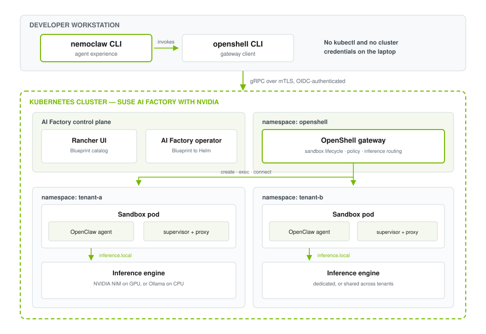
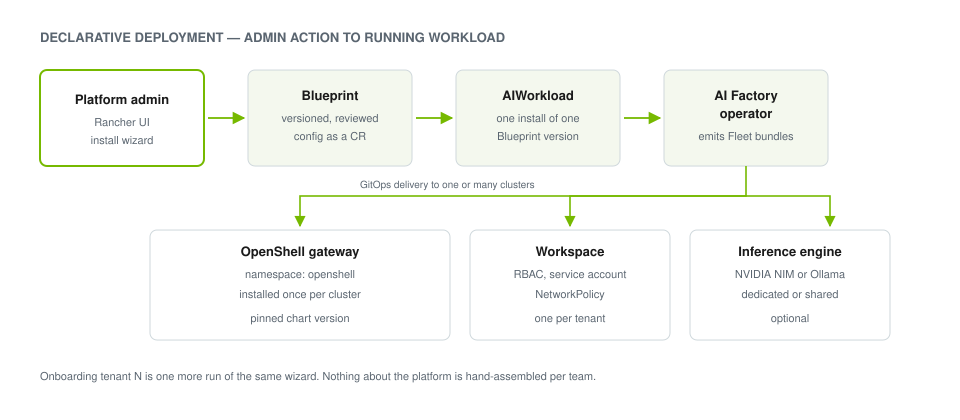
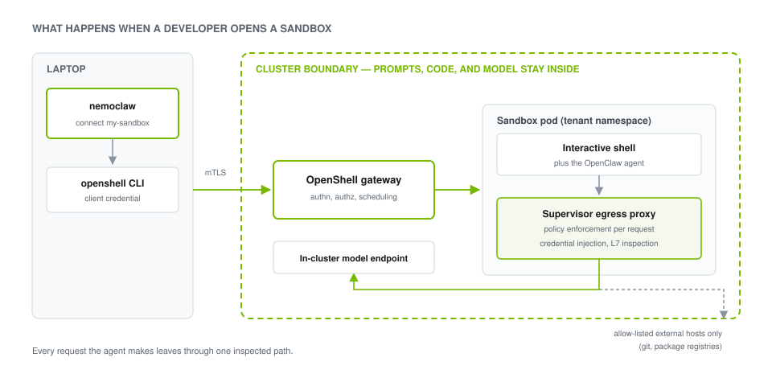
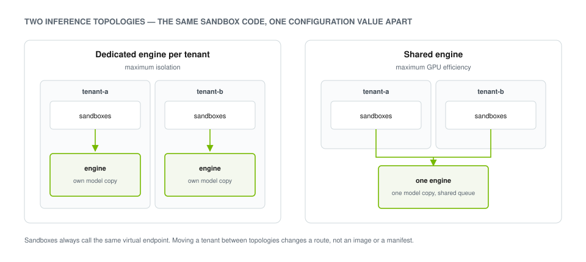

# Securing Enterprise AI: Running Multi-Tenant Coding Agents with SUSE AI Factory and NVIDIA

Coding agents moved from novelty to daily tooling faster than most platform teams could
govern them. A developer installs an agent CLI, points it at a frontier model, grants it
shell access to a repository, and productivity goes up. Then the security review starts, and
the questions are always the same: What can that agent reach? Where does our source code go
when it becomes a prompt? Which credentials did it just read out of the environment?

An ungoverned agent is an exfiltration path with a friendly interface. It reads your source,
it holds your credentials, and it makes outbound network calls on behalf of whoever last
wrote into its context window. The usual mitigation — a container on the developer's laptop —
bounds the blast radius and solves none of the governance problem. Every laptop is configured
differently, the model endpoint belongs to somebody else, and the platform team has no way to
see, shape, or revoke any of it.

**SUSE AI Factory with NVIDIA** turns that from a per-developer risk into a platform
capability. **NVIDIA OpenShell** moves the sandbox off the laptop and into infrastructure the
platform team already runs. **NVIDIA NemoClaw** keeps the developer experience a single CLI.
And SUSE AI Factory makes the whole stack an installable, versioned, auditable product rather
than a pile of manifests.

This post covers the architecture, how a deployment is expressed declaratively, how egress
policy is actually enforced, and how to keep inference — and therefore your source code —
inside the cluster boundary.

## Delivering sovereignty, simplicity, and flexibility

SUSE frames the problem it is solving bluntly: teams spend excessive time on integration and
maintenance rather than on building AI value, because the pieces arrive as fragmented tools
and Helm charts that somebody has to assemble by hand. Instead of that, AI Factory provides a
standardized assembly line for enterprise AI workloads — pre-validated NVIDIA blueprints,
delivered and lifecycle-managed as a product.

Three properties matter most for agent workloads specifically.

**Digital sovereignty.** Source code, prompts, and intellectual property stay inside your own
cluster perimeter. The AI Factory operator ships a built-in application catalog that works in
air-gapped environments, so a fully disconnected deployment is a supported configuration
rather than a workaround. That posture is what makes the centralized governance and
auditability story credible: version-controlled reference stacks with recorded source
provenance, zero-trust guardrails, continuous vulnerability scanning, and an auditable AI
stack that supports compliance regimes including the EU AI Act. It also makes cost
predictable — inference you own has a capacity bill, not a per-token bill that scales with
however chatty your agents turn out to be.

**Operational simplicity.** Blueprints are immutable, version-controlled stacks of
applications for a specific use case, deployable in a single action. SUSE handles component
selection, integration testing, security patching, and lifecycle management, with
compatibility tracked against the NVIDIA AI Enterprise Infrastructure Support Matrix. The
foundation layer — SLES 16, RKE2, and SUSE Rancher Prime, optionally with SUSE Security and
SUSE Observability — is the same platform your other workloads already run on. There are no
snowflake environments to reconcile and no spreadsheet tracking which cluster got which
version.

**Architectural flexibility.** The same Blueprints deploy against a single workstation-class
cluster, a data center, or the edge. Because every layer is an open, standard interface —
Kubernetes, Helm, OpenAI-compatible inference — you are not locked into one model, one
inference engine, or one cloud.

## Solution architecture

The stack separates into four layers, each owned by a different audience.



*Figure 1. The developer runs a CLI; the platform team runs everything else. No kubectl and
no cluster credentials are needed on the developer machine.*

| Layer | Component | Responsibility |
|---|---|---|
| Control plane | SUSE AI Factory with NVIDIA | Blueprint catalog, Kubernetes operator, Rancher Prime UI extension, GitOps delivery, lifecycle and provenance |
| Runtime sandbox | NVIDIA OpenShell | Sandbox lifecycle, workspace RBAC, egress policy enforcement, credential injection, inference routing |
| Developer interface | NVIDIA NemoClaw | The CLI that creates a sandbox, opens a shell in it, and drives the OpenClaw agent inside it |
| Inference engine | NVIDIA NIM, or any OpenAI-compatible engine | In-cluster model serving, dedicated per tenant or shared |

The structurally important property is that the developer's machine holds no cluster
credentials. NemoClaw talks to the gateway over authenticated, mutually-TLS'd gRPC. The
sandbox, the agent, the source code, and the model are all cluster-side.

## Declarative lifecycle management with Blueprints

Everything the platform team installs is expressed as a Blueprint: a custom resource pinning
a chart, a version, a target namespace, and a values document. Installing one produces an
`AIWorkload`, which the operator reconciles into GitOps bundles delivered to one or many
clusters.



*Figure 2. From an admin action in the UI to running workloads. The same path serves one
cluster or a fleet of them.*

Three Blueprints make up the stack:

| Blueprint | Scope | What it creates |
|---|---|---|
| Gateway | once per cluster | the OpenShell gateway, its service account, and TLS material |
| Workspace | once per tenant | namespace RBAC, sandbox service account, NetworkPolicy |
| Inference | once per tenant, or once per cluster | an in-cluster OpenAI-compatible model endpoint |

The gateway runs in *operator* workspace mode: one gateway serves many pre-provisioned
namespaces, discovered by label.

```yaml
server:
  drivers:
    kubernetes:
      workspaceMode: operator
      operatorNamespaceLabel: ai-factory.suse.com/openshell-workspace=true
```

That single value is what makes tenant onboarding repeatable. Label a namespace, run the
Workspace Blueprint against it, and the existing gateway discovers it live — no gateway
restart, no gateway reconfiguration, no per-tenant control plane. Onboarding the tenth team is
the same operation as onboarding the first.

Because the configuration lives in a versioned, immutable resource rather than in someone's
`values.yaml`, it is reviewable and diffable, and its provenance is recorded. Changing a
sandbox base image or an egress policy is a new Blueprint version, not an undocumented
cluster mutation.

## Enforcing zero-trust isolation

Inside each sandbox pod runs an OpenShell supervisor. Every outbound connection the agent
attempts goes through it.



*Figure 3. The agent has no direct network path out. Policy is evaluated per request, in a
process the agent does not control.*

This is the part that matters for prompt injection. An agent that can be talked into
exfiltrating a credential is a normal outcome, not an exotic one — any control the agent can
reach is a control it can be argued out of. So the enforcement point sits outside the agent's
process entirely, in a component the agent cannot configure.

The supervisor does more than allow or deny by hostname. For endpoints declared with L7
inspection, it terminates TLS, inspects the request, and enforces method- and path-level
rules — so "this sandbox may read from GitHub, but not write to it" is expressible as exactly
that:

```yaml
- host: github.com
  port: 443
  protocol: rest
  tls: terminate
  enforcement: enforce
  rules:
    - allow: { method: GET,  path: "/**/info/refs*" }      # clone, fetch, pull
    - allow: { method: POST, path: "/**/git-upload-pack" }
    # write access stays commented out until a repo is named explicitly
```

The supervisor is also where credentials are injected. Developers never handle a raw provider
API key, and neither does the agent. The agent calls a virtual endpoint; the supervisor swaps
in the real secret on the way out. A prompt-injection attack that convinces the agent to print
its environment gets a placeholder.

## Keeping inference inside the perimeter

Sandboxes reach their model through a fixed virtual endpoint, `https://inference.local`. The
supervisor resolves that to whatever the platform team has routed it to, rewriting the model
name and injecting the provider credential in the process.

That indirection is what makes the inference topology an infrastructure decision rather than
an application setting.



*Figure 4. Both topologies are the same Blueprint with a different target namespace. The
sandbox does not know or care which one it is using.*

A dedicated engine per tenant gives the strongest isolation: no shared queue, no shared
process, and deleting the tenant namespace removes the engine with it. A shared engine
amortizes the model across tenants, which matters when the model occupies GPU memory. Routing
updates propagate to running sandboxes in seconds, so moving a tenant between the two is a
configuration change, not a redeployment.

For production workloads, point that route at **NVIDIA NIM**. NIM packages optimized inference
microservices behind an OpenAI-compatible API, which is exactly the contract the supervisor
expects — the sandbox side is unchanged. Wiring is two commands:

```bash
openshell --workspace tenant-a provider create \
  --name nim \
  --type openai \
  --credential OPENAI_API_KEY=<key> \
  --config OPENAI_BASE_URL=http://<nim-service>.<namespace>.svc.cluster.local:8000/v1

openshell --workspace tenant-a inference set --provider nim --model <model-id>
```

Providers and inference routes are workspace-scoped. Each tenant gets its own, which is what
lets different teams run different models against one gateway.

## The developer experience

None of the above should be visible to the person writing code. From a developer's laptop,
with no kubectl and no kubeconfig:

```console
$ nemoclaw my-sandbox connect
sandbox@my-sandbox:~$ hostname
my-sandbox
```

That prompt is a shell in a pod in the cluster, with the OpenClaw agent already running beside
it and a model endpoint already wired. From here the developer works interactively, or hands
the task to the agent and lets the supervisor enforce what it is allowed to touch.

Today, pointing NemoClaw at a cluster-hosted gateway rather than a local one is a matter of
configuration — a gateway registration and a workspace scope. NemoClaw invokes the `openshell`
CLI for sandbox operations, so targeting a remote gateway requires neither patching it nor
relaxing any of its security guards. Making that a first-class, documented mode is the obvious
next step for the integration.

## Production considerations

A few decisions matter more than the rest when you move past a proof of concept.

**Turn on authentication before the second user.** The gateway ships an
`allowUnauthenticatedUsers` switch that is convenient for a single-operator prototype and
inappropriate for anything shared — with it enabled, every caller is treated as a platform
administrator and OpenShell's own workspace RBAC is inert. Configure OIDC against your identity
provider and map the admin and user roles.

**Expose the gateway properly.** Port-forwarding is fine for a demo. A real deployment
publishes the gateway through a Gateway API `GRPCRoute` or an OpenShift Route and authenticates
users with OIDC rather than distributing client certificates.

**Size inference for agent workloads, not for chat.** An agent turn is not one short request.
Agent harnesses send large system prompts describing every available tool, and they send them
on every turn. A model that answers a single question acceptably on CPU can be unusable inside
an agent loop, because prompt processing dominates and a larger model makes each pass slower
rather than faster. If you intend to demonstrate autonomous agent behavior rather than platform
mechanics, plan for GPU-backed inference from the start.

**Pin your chart versions and verify the pin.** A workload reporting `Running` is not evidence
that the version you selected is the version installed.

## SUSE AI Factory with NVIDIA: making enterprise AI real

Coding agents are the sharpest current example of a general problem: AI workloads want broad
access to your most sensitive assets, and the enforcement point has to live somewhere your
users cannot reach. Putting the sandbox in the cluster, the model in the cluster, and the
policy in a supervisor the agent does not control is what turns an ungoverned productivity tool
into a platform capability you can hand to a regulated organization.

SUSE AI Factory with NVIDIA makes that deployable as a product rather than a project: validated
blueprints, immutable versions, air-gap support, and one lifecycle for the whole stack.

- [SUSE AI Factory with NVIDIA documentation](https://documentation.suse.com/suse-ai-factory/latest/html/AI-Factory-NVIDIA-introduction/index.html)
- [NVIDIA OpenShell](https://github.com/NVIDIA/OpenShell) — gateway, supervisor, and Helm charts
- [NVIDIA NemoClaw](https://github.com/NVIDIA/NemoClaw) — the developer CLI
- [NVIDIA NIM](https://developer.nvidia.com/nim) — optimized inference microservices

<!-- TODO: replace with the real URL before publishing -->
See it end to end in the demo video: **[VIDEO URL]**

If you are evaluating agent tooling for a regulated environment, the question worth starting
from is not which agent is most capable. It is where the enforcement point sits, and who
controls it.
